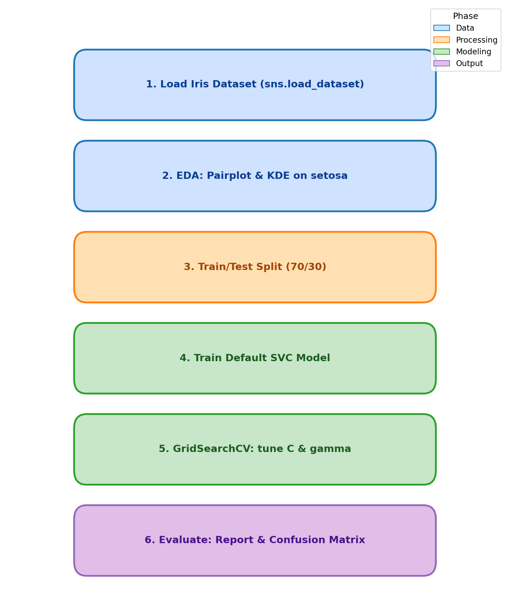

<div align="center">

# Lab 10: Support Vector Machines

**Multiclass Iris Classification with SVM and Hyperparameter Tuning**

[](#)
[](#)
[](#)
[](#)
[](#)
[](#)
[](#)
[](#)

</div>

---

## Overview

> Given Fisher's Iris flower dataset (150 samples, 3 species), **classify each flower into one of three species** (setosa, versicolor, virginica) using a Support Vector Classifier, then tune `C` and `gamma` with `GridSearchCV`.

> **Note:** This lab follows the SVM tutorial (`01-Support Vector Machines.ipynb`, based on the built-in `load_breast_cancer` dataset) and applies the same methodology to the Iris dataset in the assignment notebook (`02-SVM Assignment.ipynb`).

| | Detail |
|---|--------|
| **Lab Topic** | Support Vector Machines (SVM) |
| **Tutorial Dataset** | Breast Cancer Wisconsin (`load_breast_cancer` from sklearn) |
| **Assignment Dataset** | Iris (`sns.load_dataset('iris')`) |
| **Problem Type** | Multiclass Classification |
| **Target** | `species` (setosa / versicolor / virginica) |
| **Samples** | 150 (50 per class) |
| **Features** | 4 numeric measurements |
| **Model** | `SVC` (sklearn) with RBF kernel |
| **Tuning** | `GridSearchCV` over `C` and `gamma` |

---

## Dataset Features

| # | Feature | Description | Type |
|:-:|---------|-------------|:----:|
| 1 | `sepal_length` | Sepal length in centimeters | Numeric |
| 2 | `sepal_width` | Sepal width in centimeters | Numeric |
| 3 | `petal_length` | Petal length in centimeters | Numeric |
| 4 | `petal_width` | Petal width in centimeters | Numeric |
| 5 | `species` | Target class (setosa / versicolor / virginica) | Categorical |

---

## Key Concepts

| Concept | Description |
|---------|-------------|
| Support Vector Machine | Supervised learner that finds the maximum-margin hyperplane separating classes; works for both classification and regression |
| Kernel Trick | Maps input features into a higher-dimensional space to handle non-linearly separable data — `rbf` (radial basis function) is the default |
| `C` (Regularization) | Trades off margin width vs. misclassification: small `C` = wider margin & more errors, large `C` = narrower margin & fewer errors |
| `gamma` | Controls how far the influence of a single training example reaches: low gamma = smoother decision boundary, high gamma = tighter fit |
| `GridSearchCV` | Cross-validated exhaustive search over a parameter grid; refits the best estimator on the full training set |

---

## Methodology

<div align="center">



</div>

| Step | Phase | Description |
|:----:|-------|-------------|
| 1 | Data Loading | Load Iris with `sns.load_dataset('iris')` |
| 2 | EDA | `sns.pairplot` colored by species; KDE plot of `sepal_length` vs `sepal_width` for the setosa class |
| 3 | Train/Test Split | 70/30 split of features (`X`) and target (`y`) |
| 4 | Initial SVC | Fit a default `SVC()` model on the training data |
| 5 | GridSearchCV | Search over `C ∈ {0.1, 1, 10, 100}` and `gamma ∈ {1, 0.1, 0.01, 0.001}` to pick the best estimator |
| 6 | Evaluation | Predict on the test set and report `classification_report` and `confusion_matrix` for both the default and tuned models |

---

## Files

```
Lab10/
├── 01-Support Vector Machines.ipynb   # Doctor's tutorial notebook (Breast Cancer dataset)
├── 02-SVM Assignment.ipynb            # Assignment — SVM on the Iris dataset
├── methodology_diagram.png            # Workflow diagram
└── README.md                          # This file
```
