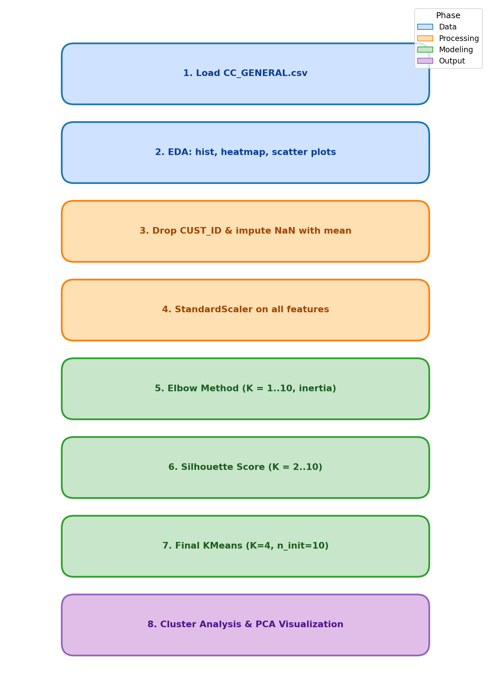

<div align="center">

# Lab 11: K-Means Clustering

**Customer Segmentation with K-Means on Credit Card Behavior Data**

[](#)
[](#)
[](#)
[](#)
[](#)
[](#)
[](#)
[](#)

</div>

---

## Overview

> Given 8,950 credit card customers and 17 behavioral features (balance, purchases, cash advance, payments, etc.), **discover natural customer segments** with K-Means so the company can design targeted marketing strategies. This is an **unsupervised** problem — the dataset has no target label.

> **Note:** This lab follows the K-Means tutorial (`01-Customer Segmentation with K-Means.ipynb`, based on the `mall_customers.csv` dataset) and applies the same methodology to the credit card data in the project notebook (`02-Credit Card Customer Segmentation Assignment.ipynb`).

| | Detail |
|---|--------|
| **Lab Topic** | K-Means Clustering |
| **Tutorial Dataset** | `mall_customers.csv` (200 customers, Income vs Spending Score) |
| **Assignment Dataset** | `CC_GENERAL.csv` (8,950 credit card customers) |
| **Problem Type** | Unsupervised Clustering |
| **Target** | None (no labels — we discover groups) |
| **Samples** | 8,950 customers |
| **Features** | 17 behavioral metrics (after dropping `CUST_ID`) |
| **Model** | `KMeans` (sklearn) with `n_init=10`, `random_state=42` |
| **Final K** | 4 clusters |
| **Key Techniques** | StandardScaler, Elbow Method, Silhouette Score, PCA for visualization |

---

## Dataset Features

| # | Feature | Description |
|:-:|---------|-------------|
| 1 | `BALANCE` | Account balance remaining on the credit card |
| 2 | `BALANCE_FREQUENCY` | How often the balance is updated (0–1) |
| 3 | `PURCHASES` | Total amount of purchases made |
| 4 | `ONEOFF_PURCHASES` | Maximum one-off purchase amount |
| 5 | `INSTALLMENTS_PURCHASES` | Total amount of installment purchases |
| 6 | `CASH_ADVANCE` | Cash advanced from the card |
| 7 | `PURCHASES_FREQUENCY` | How often purchases happen (0–1) |
| 8 | `ONEOFF_PURCHASES_FREQUENCY` | Frequency of one-off purchases (0–1) |
| 9 | `PURCHASES_INSTALLMENTS_FREQUENCY` | Frequency of installment purchases (0–1) |
| 10 | `CASH_ADVANCE_FREQUENCY` | How often cash is advanced (0–1) |
| 11 | `CASH_ADVANCE_TRX` | Number of cash advance transactions |
| 12 | `PURCHASES_TRX` | Number of purchase transactions |
| 13 | `CREDIT_LIMIT` | Credit card limit |
| 14 | `PAYMENTS` | Amount of payments made by the user |
| 15 | `MINIMUM_PAYMENTS` | Minimum payment amount |
| 16 | `PRC_FULL_PAYMENT` | Percentage of full payments made |
| 17 | `TENURE` | Months as a credit card customer |

---

## Key Concepts

| Concept | Description |
|---------|-------------|
| K-Means | Partitions data into K clusters by repeatedly assigning each point to its nearest centroid and recomputing the centroids |
| Centroid | Mean position of all points in a cluster — represents the "center" of that group |
| Inertia | Sum of squared distances from each point to its assigned centroid; lower = tighter clusters |
| Elbow Method | Plot inertia vs K and pick the K where the curve bends — beyond that point, adding clusters gives little improvement |
| Silhouette Score | Measures how well-separated clusters are (range −1 to 1); higher = better |
| StandardScaler | Rescales features to mean 0 and std 1, so K-Means' distance calculations aren't dominated by large-valued columns |
| PCA | Projects the 17-D data down to 2 components purely for visualization — doesn't affect the clustering |

---

## Methodology

<div align="center">



</div>

| Step | Phase | Description |
|:----:|-------|-------------|
| 1 | Data Loading | Load `CC_GENERAL.csv` (8,950 × 18) |
| 2 | EDA | Histograms, correlation heatmap, scatter plots (`BALANCE` vs `PURCHASES`, `BALANCE` vs `CASH_ADVANCE`) |
| 3 | Cleaning | Drop `CUST_ID`; fill missing values in `CREDIT_LIMIT` (1) and `MINIMUM_PAYMENTS` (313) with column means |
| 4 | Scaling | `StandardScaler` on all 17 features → `X_scaled` |
| 5 | Elbow Method | Fit K-Means for K = 1..10, record `inertia_`, plot the curve |
| 6 | Silhouette Score | Compute `silhouette_score` for K = 2..10 and plot |
| 7 | Final Model | Fit `KMeans(n_clusters=4, random_state=42, n_init=10)`; attach labels as a `Cluster` column |
| 8 | Interpretation | `groupby('Cluster').mean()` to describe each segment; PCA to 2-D for visualization |

---

## Files

```
Lab11/
├── CC_GENERAL.csv                                                  # Credit card project dataset (8,950 rows)
├── mall_customers.csv                                              # Tutorial dataset (200 rows)
├── 01-Customer Segmentation with K-Means.ipynb                     # Doctor's tutorial notebook
├── 02-Credit Card Customer Segmentation Assignment.ipynb           # Project — K-Means on credit card data
├── methodology_diagram.png                                         # Workflow diagram
└── README.md                                                       # This file
```
