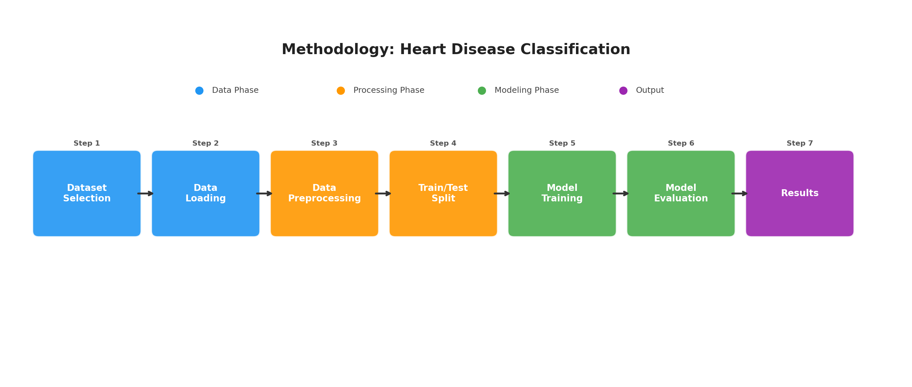

<div align="center">

# Lab 2: Heart Disease Classification

**Identifying ML Problems, Selecting Open Datasets, and Drawing a Methodology Diagram**

[](https://archive.ics.uci.edu/ml/datasets/heart+Disease)
[](#)
[](#)
[](#)

</div>

---

## Problem Statement

> Given patient medical attributes (age, sex, chest pain type, resting blood pressure, cholesterol, etc.), **predict whether the patient has heart disease or not**.

| | Detail |
|---|--------|
| **Type** | Binary Classification |
| **Target** | `target` — 0 (No Disease) / 1 (Disease) |
| **Source** | [UCI Machine Learning Repository](https://archive.ics.uci.edu/ml/datasets/heart+Disease) |
| **Samples** | 297 patients |
| **Class Balance** | 160 healthy, 137 disease |

---

## Dataset Features

| # | Feature | Description | Type |
|:-:|---------|-------------|:----:|
| 1 | `age` | Age in years | Numeric |
| 2 | `sex` | 1 = Male, 0 = Female | Binary |
| 3 | `cp` | Chest pain type (1–4) | Categorical |
| 4 | `trestbps` | Resting blood pressure (mm Hg) | Numeric |
| 5 | `chol` | Serum cholesterol (mg/dl) | Numeric |
| 6 | `fbs` | Fasting blood sugar > 120 mg/dl | Binary |
| 7 | `restecg` | Resting ECG results (0–2) | Categorical |
| 8 | `thalach` | Maximum heart rate achieved | Numeric |
| 9 | `exang` | Exercise-induced angina (1 = yes) | Binary |
| 10 | `oldpeak` | ST depression induced by exercise | Numeric |
| 11 | `slope` | Slope of peak exercise ST segment | Categorical |
| 12 | `ca` | Major vessels colored by fluoroscopy | Numeric |
| 13 | `thal` | Thalassemia (3 = normal, 6 = fixed, 7 = reversible) | Categorical |

---

## Methodology

<div align="center">



</div>

| Step | Phase | Description |
|:----:|-------|-------------|
| 1 | Dataset Selection | Choose the UCI Heart Disease dataset |
| 2 | Data Loading | Load the CSV file using Pandas |
| 3 | Data Preprocessing | Handle missing values, encode categorical variables, normalize features |
| 4 | Train/Test Split | Split data into 80% training / 20% testing |
| 5 | Model Training | Train classifiers (Decision Tree, KNN, Random Forest) |
| 6 | Model Evaluation | Evaluate with accuracy, precision, recall, and confusion matrix |
| 7 | Results | Compare model performance and select the best model |

---

## Files

```
Lab2/
├── heart.csv                  # Cleaned UCI Heart Disease dataset
├── Lab2.ipynb                 # Jupyter Notebook — data loading & inspection
├── methodology_diagram.png    # ML workflow diagram
└── README.md                  # This file
```
