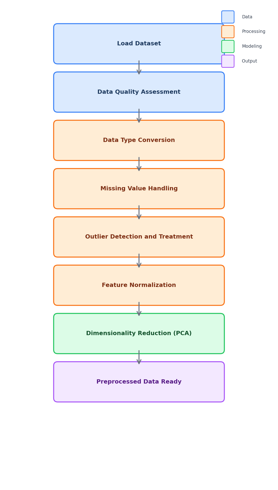

<div align="center">

# Lab 4: Data Quality Assessment and Preprocessing

**Cleaning, Transforming, and Preparing Data for Machine Learning**

[](#)
[](#)
[](#)
[](#)
[](#)
[](#)
[](#)

</div>

---

## Overview

> In real-world machine learning projects, data is often incomplete, noisy, or inconsistent. Before building any model, we must **clean and prepare the data** properly.

| | Detail |
|---|--------|
| **Lab Topic** | Data Quality Assessment and Preprocessing |
| **Dataset** | UCI Heart Disease |
| **Samples** | 297 patients |
| **Features** | 14 columns (13 features + 1 target) |
| **Techniques** | Type conversion, imputation, outlier handling, normalization, PCA |

---

## Dataset Features

| # | Feature | Description | Type |
|:-:|---------|-------------|:----:|
| 1 | `age` | Age in years | Numeric |
| 2 | `sex` | 1 = Male, 0 = Female | Binary |
| 3 | `cp` | Chest pain type (0-3) | Categorical |
| 4 | `trestbps` | Resting blood pressure (mm Hg) | Numeric |
| 5 | `chol` | Serum cholesterol (mg/dl) | Numeric |
| 6 | `fbs` | Fasting blood sugar > 120 mg/dl | Binary |
| 7 | `restecg` | Resting ECG results (0-2) | Categorical |
| 8 | `thalach` | Maximum heart rate achieved | Numeric |
| 9 | `exang` | Exercise-induced angina (1 = yes) | Binary |
| 10 | `oldpeak` | ST depression induced by exercise | Numeric |
| 11 | `slope` | Slope of peak exercise ST segment | Categorical |
| 12 | `ca` | Major vessels colored by fluoroscopy | Numeric |
| 13 | `thal` | Thalassemia type | Categorical |

---

## Preprocessing Techniques

| # | Technique | Description |
|:-:|-----------|-------------|
| 1 | Data Type Conversion | Convert categorical columns stored as integers to category type |
| 2 | Missing Value Detection | Identify null entries with `isna()` |
| 3 | Row Removal | Drop rows with missing values |
| 4 | Mean Imputation | Replace missing values with column mean |
| 5 | Median Imputation | Replace missing values with column median |
| 6 | IQR Outlier Detection | Identify values outside Q1-1.5*IQR and Q3+1.5*IQR |
| 7 | Outlier Capping | Clip extreme values at 5th/95th percentiles |
| 8 | Min-Max Normalization | Scale features to [0, 1] range |
| 9 | Z-Score Standardization | Center features to mean=0, std=1 |
| 10 | PCA | Reduce dimensionality via principal components |

---

## Methodology

<div align="center">



</div>

| Step | Phase | Description |
|:----:|-------|-------------|
| 1 | Data Loading | Load Heart Disease CSV using Pandas |
| 2 | Data Quality Assessment | Check data types, missing values, distributions |
| 3 | Type Conversion | Convert categorical columns to proper types |
| 4 | Missing Value Handling | Apply removal, mean imputation, and median imputation |
| 5 | Outlier Treatment | Detect with IQR, handle with removal and capping |
| 6 | Normalization | Apply Min-Max and Z-Score scaling |
| 7 | Dimensionality Reduction | Apply PCA and interpret variance ratios |
| 8 | Preprocessed Output | Data ready for downstream modeling |

---

## Files

```
Lab4/
├── heart.csv                      # UCI Heart Disease dataset (297 rows)
├── Lab4.ipynb                     # Jupyter Notebook — preprocessing techniques
├── methodology_diagram.png        # Preprocessing workflow diagram
└── README.md                      # This file
```
