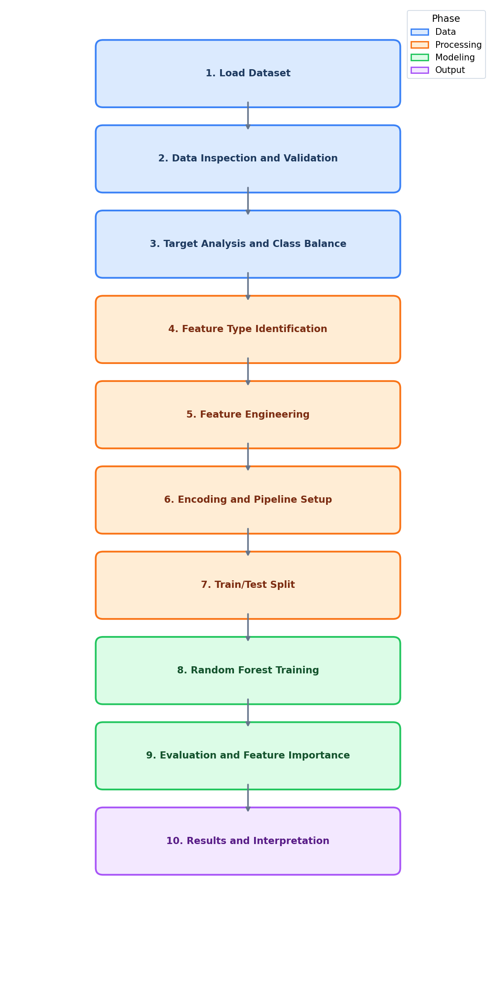

<div align="center">

# Lab 5: Feature Engineering for Classification

**Heart Disease Prediction using Feature Engineering**

[](#)
[](#)
[](#)
[](#)
[](#)
[](#)
[](#)

</div>

---

## Overview

> Given patient medical attributes, **predict whether the patient has heart disease** by engineering meaningful features and training a Random Forest classifier.

| | Detail |
|---|--------|
| **Lab Topic** | Feature Engineering for Classification |
| **Dataset** | UCI Heart Disease |
| **Problem Type** | Binary Classification |
| **Target** | `target` (0 = No Disease, 1 = Disease) |
| **Samples** | 297 patients |
| **Features** | 13 original + 5 engineered |
| **Model** | Random Forest Classifier |

---

## Feature Engineering Techniques

| # | Technique | Description |
|:-:|-----------|-------------|
| 1 | Age Binning | Group ages into clinical categories (Young, Middle, Senior, Elderly) |
| 2 | BP Risk Category | Classify blood pressure as Normal, Elevated, or High |
| 3 | Cholesterol Risk Level | Categorize cholesterol as Desirable, Borderline, or High |
| 4 | Heart Rate Reserve | Compute difference between max heart rate and resting baseline |
| 5 | Exercise Risk Score | Composite of exercise angina, ST depression, and slope |
| 6 | One-Hot Encoding | Convert categorical features to numerical via ColumnTransformer |
| 7 | Standard Scaling | Normalize numerical features to mean=0, std=1 |

---

## Dataset Features

| # | Feature | Description | Type |
|:-:|---------|-------------|:----:|
| 1 | `age` | Age in years | Numeric |
| 2 | `sex` | 1 = Male, 0 = Female | Binary |
| 3 | `cp` | Chest pain type (0-3) | Categorical |
| 4 | `trestbps` | Resting blood pressure (mm Hg) | Numeric |
| 5 | `chol` | Serum cholesterol (mg/dl) | Numeric |
| 6 | `fbs` | Fasting blood sugar > 120 mg/dl | Binary |
| 7 | `restecg` | Resting ECG results (0-2) | Categorical |
| 8 | `thalach` | Maximum heart rate achieved | Numeric |
| 9 | `exang` | Exercise-induced angina (1 = yes) | Binary |
| 10 | `oldpeak` | ST depression induced by exercise | Numeric |
| 11 | `slope` | Slope of peak exercise ST segment | Categorical |
| 12 | `ca` | Major vessels colored by fluoroscopy | Numeric |
| 13 | `thal` | Thalassemia type | Categorical |

---

## Methodology

<div align="center">



</div>

| Step | Phase | Description |
|:----:|-------|-------------|
| 1 | Data Loading | Load Heart Disease CSV (297 rows) |
| 2 | Data Inspection | Confirm data quality (no missing values, no duplicates) |
| 3 | Target Analysis | Examine target distribution and class balance |
| 4 | Feature Types | Identify numerical and categorical columns |
| 5 | Feature Engineering | Create age groups, BP risk, cholesterol risk, HR reserve, exercise score |
| 6 | Encoding | One-hot encode categorical, scale numerical via Pipeline |
| 7 | Train/Test Split | Stratified 80/20 split |
| 8 | Model Training | Fit Random Forest classifier |
| 9 | Evaluation | Classification report, confusion matrix, feature importance |
| 10 | Results | Compare with/without engineered features |

---

## Files

```
Lab5/
├── heart.csv                      # UCI Heart Disease dataset (297 rows)
├── Lab5.ipynb                     # Jupyter Notebook — feature engineering
├── methodology_diagram.png        # Feature engineering workflow diagram
└── README.md                      # This file
```
