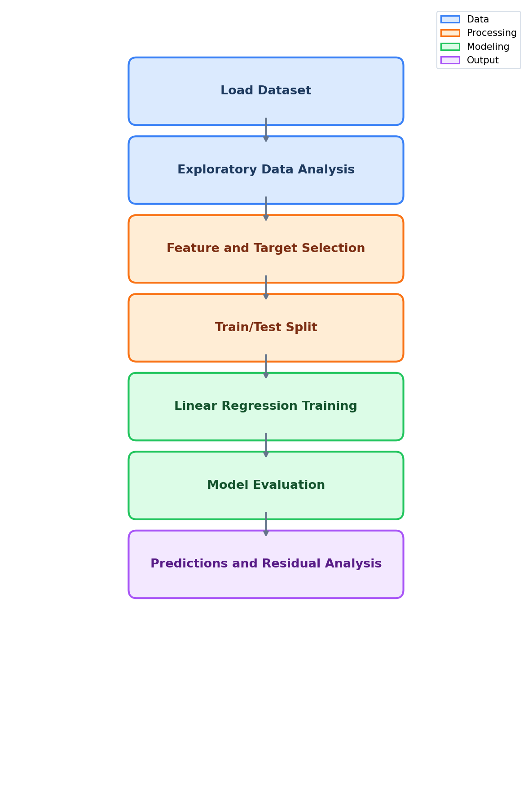

<div align="center">

# Lab 6: Linear Regression

**Predicting Housing Prices with Linear Regression**

[](#)
[](#)
[](#)
[](#)
[](#)
[](#)
[](#)
[](#)

</div>

---

## Overview

> Given housing data for regions in the USA, **predict the sale price** of a house using its area attributes such as income, house age, number of rooms, and population.

> **Note:** This lab uses the USA Housing dataset instead of the Heart Disease dataset used in Labs 2-5. Linear regression requires a **continuous target variable** (house Price), while the Heart Disease dataset has a binary classification target (0/1) which is not suitable for linear regression.

| | Detail |
|---|--------|
| **Lab Topic** | Linear Regression |
| **Dataset** | USA Housing |
| **Problem Type** | Regression |
| **Target** | `Price` |
| **Samples** | 5,000 houses |
| **Features** | 5 numerical predictors |
| **Model** | Linear Regression (sklearn) |
| **Metrics** | MAE, MSE, RMSE |

---

## Dataset Features

| # | Feature | Description | Type |
|:-:|---------|-------------|:----:|
| 1 | `Avg. Area Income` | Average income of area residents | Numeric |
| 2 | `Avg. Area House Age` | Average age of houses in the area | Numeric |
| 3 | `Avg. Area Number of Rooms` | Average number of rooms | Numeric |
| 4 | `Avg. Area Number of Bedrooms` | Average number of bedrooms | Numeric |
| 5 | `Area Population` | Population of the area | Numeric |
| 6 | `Price` | House sale price (target) | Numeric |
| 7 | `Address` | House address (dropped for modeling) | Text |

---

## Evaluation Metrics

| Metric | Formula | Description |
|:------:|---------|-------------|
| MAE | Mean Absolute Error | Average of absolute differences between predicted and actual |
| MSE | Mean Squared Error | Average of squared differences (punishes larger errors) |
| RMSE | Root Mean Squared Error | Square root of MSE (interpretable in target units) |

---

## Methodology

<div align="center">



</div>

| Step | Phase | Description |
|:----:|-------|-------------|
| 1 | Data Loading | Load USA Housing CSV using Pandas |
| 2 | EDA | Pairplot, distribution plots, correlation heatmap |
| 3 | Feature Selection | Select 5 numerical predictors, drop Address |
| 4 | Train/Test Split | Split data 60/40 (random_state=101) |
| 5 | Model Training | Fit sklearn LinearRegression |
| 6 | Evaluation | Interpret coefficients; compute MAE, MSE, RMSE |
| 7 | Residual Analysis | Scatter plot (actual vs predicted), residual histogram |

---

## Files

```
Lab6/
├── USA_Housing.csv                # Housing dataset (5,000 rows)
├── Ecommerce_Customers.csv        # Assignment dataset (1,000 rows)
├── Lab6.ipynb                     # Jupyter Notebook — linear regression
├── methodology_diagram.png        # Regression workflow diagram
└── README.md                      # This file
```
