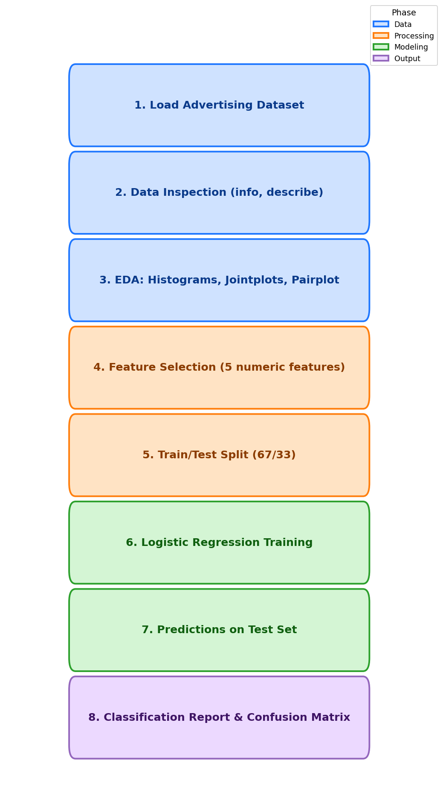

<div align="center">

# Lab 7: Logistic Regression

**Predicting Ad Clicks with Logistic Regression**

[](#)
[](#)
[](#)
[](#)
[](#)
[](#)
[](#)
[](#)

</div>

---

## Overview

> Given user behavior and demographic data from an advertising company, **predict whether an internet user will click on an advertisement** based on their features.

> **Note:** This lab follows the Logistic Regression tutorial (`01-Logistic Regression.ipynb`, based on the Titanic dataset) and applies the same methodology to the Advertising dataset assignment (`02-Logistic Regression Assignment.ipynb`).

| | Detail |
|---|--------|
| **Lab Topic** | Logistic Regression |
| **Tutorial Dataset** | Titanic (`titanic_train.csv`) |
| **Assignment Dataset** | Advertising (`advertising.csv`) |
| **Problem Type** | Binary Classification |
| **Target** | `Clicked on Ad` (0 = No Click, 1 = Click) |
| **Samples** | 1,000 users |
| **Features** | 5 numeric predictors |
| **Model** | Logistic Regression (sklearn) |
| **Metrics** | Precision, Recall, F1-Score, Confusion Matrix |

---

## Dataset Features

| # | Feature | Description | Type |
|:-:|---------|-------------|:----:|
| 1 | `Daily Time Spent on Site` | Consumer time on site in minutes | Numeric |
| 2 | `Age` | User age in years | Numeric |
| 3 | `Area Income` | Average income of the user's geographical area | Numeric |
| 4 | `Daily Internet Usage` | Average minutes per day on internet | Numeric |
| 5 | `Ad Topic Line` | Headline of the advertisement | Text (dropped) |
| 6 | `City` | User city | Text (dropped) |
| 7 | `Male` | Whether the user is male (1/0) | Binary |
| 8 | `Country` | User country | Text (dropped) |
| 9 | `Timestamp` | Click or browse timestamp | Text (dropped) |
| 10 | `Clicked on Ad` | Target variable (1 = clicked) | Binary |

---

## Evaluation Metrics

| Metric | Description |
|:------:|-------------|
| Precision | Of all predicted clicks, what fraction were actual clicks |
| Recall | Of all actual clicks, what fraction did the model catch |
| F1-Score | Harmonic mean of precision and recall |
| Confusion Matrix | Breakdown of true/false positives and negatives |

---

## Methodology

<div align="center">



</div>

| Step | Phase | Description |
|:----:|-------|-------------|
| 1 | Data Loading | Load `advertising.csv` using Pandas |
| 2 | Data Inspection | `head()`, `info()`, `describe()` |
| 3 | EDA | Age histogram, Area Income vs Age jointplot, KDE jointplot, pairplot with `hue='Clicked on Ad'` |
| 4 | Feature Selection | Keep 5 numeric predictors, drop text/timestamp columns |
| 5 | Train/Test Split | 67/33 split (`random_state=42`) |
| 6 | Model Training | Fit `LogisticRegression()` on training set |
| 7 | Prediction | Predict clicks on the held-out test set |
| 8 | Evaluation | Print `classification_report` and `confusion_matrix` |

---

## Files

```
Lab7/
├── advertising.csv                          # Advertising dataset (1,000 rows)
├── titanic_train.csv                        # Tutorial dataset (Titanic)
├── 01-Logistic Regression.ipynb             # Doctor's tutorial notebook
├── 02-Logistic Regression Assignment.ipynb  # Assignment — Logistic Regression on advertising data
├── methodology_diagram.png                  # Workflow diagram
└── README.md                                # This file
```
