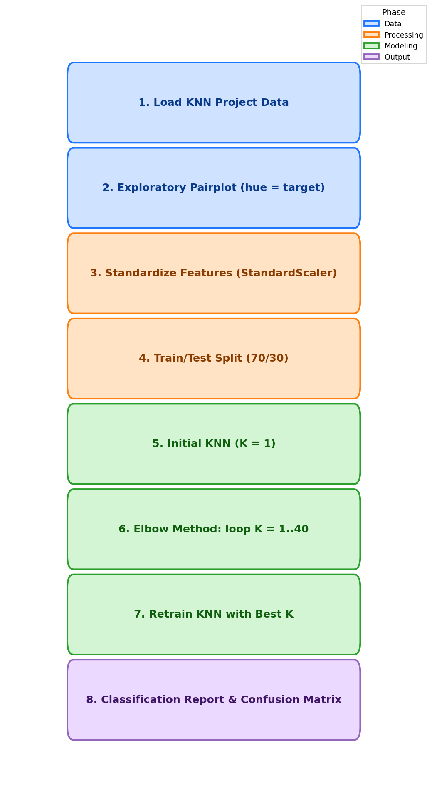

<div align="center">

# Lab 8: K-Nearest Neighbors

**Classifying Anonymized Data with KNN and the Elbow Method**

[](#)
[](#)
[](#)
[](#)
[](#)
[](#)
[](#)
[](#)

</div>

---

## Overview

> Given an anonymized dataset with 10 unlabeled numeric features, **classify each observation into one of two target classes** using K-Nearest Neighbors, with the optimal K chosen via the elbow method.

> **Note:** This lab follows the KNN tutorial (`01-K Nearest Neighbors.ipynb`, based on the `Classified Data` file) and applies the same methodology to the `KNN_Project_Data` assignment (`02-K Nearest Neighbors Assignment.ipynb`).

| | Detail |
|---|--------|
| **Lab Topic** | K-Nearest Neighbors (KNN) |
| **Tutorial Dataset** | `Classified Data` |
| **Assignment Dataset** | `KNN_Project_Data` |
| **Problem Type** | Binary Classification |
| **Target** | `TARGET CLASS` (0 or 1) |
| **Samples** | 1,000 rows |
| **Features** | 10 anonymized numeric features |
| **Model** | KNeighborsClassifier (sklearn) |
| **Key Technique** | Elbow method for choosing K |

---

## Dataset Features

| # | Feature | Description | Type |
|:-:|---------|-------------|:----:|
| 1 | `XVPM` | Anonymized feature 1 | Numeric |
| 2 | `GWYH` | Anonymized feature 2 | Numeric |
| 3 | `TRAT` | Anonymized feature 3 | Numeric |
| 4 | `TLLZ` | Anonymized feature 4 | Numeric |
| 5 | `IGGA` | Anonymized feature 5 | Numeric |
| 6 | `HYKR` | Anonymized feature 6 | Numeric |
| 7 | `EDFS` | Anonymized feature 7 | Numeric |
| 8 | `GUUB` | Anonymized feature 8 | Numeric |
| 9 | `MGJM` | Anonymized feature 9 | Numeric |
| 10 | `JHZC` | Anonymized feature 10 | Numeric |
| 11 | `TARGET CLASS` | Target variable (0 / 1) | Binary |

---

## Key Concepts

| Concept | Description |
|---------|-------------|
| Feature Scaling | KNN uses Euclidean distance, so all features must be standardized with `StandardScaler` before training |
| Choice of K | A low K overfits (K=1 memorizes training data); a high K underfits. The elbow method visualizes error rate across K values |
| Elbow Method | Loop K = 1..40, compute mean prediction error for each, and plot; choose the K where the error curve "bends" |

---

## Methodology

<div align="center">



</div>

| Step | Phase | Description |
|:----:|-------|-------------|
| 1 | Data Loading | Load `KNN_Project_Data` using Pandas |
| 2 | EDA | `sns.pairplot` with `hue='TARGET CLASS'` to inspect separability |
| 3 | Standardization | Fit `StandardScaler` on features and transform into a scaled DataFrame |
| 4 | Train/Test Split | 70/30 split (`random_state=101`) |
| 5 | Initial KNN | Fit `KNeighborsClassifier(n_neighbors=1)` and evaluate |
| 6 | Elbow Method | Loop K = 1..40, track mean error, plot error rate vs K |
| 7 | Retrain | Fit KNN with the chosen K (30) and predict on test set |
| 8 | Evaluation | Print `classification_report` and `confusion_matrix` |

---

## Files

```
Lab8/
├── Classified Data                               # Tutorial dataset
├── KNN_Project_Data                              # Assignment dataset (1,000 rows)
├── 01-K Nearest Neighbors.ipynb                  # Doctor's tutorial notebook
├── 02-K Nearest Neighbors Assignment.ipynb       # Assignment — KNN on KNN_Project_Data
├── methodology_diagram.png                       # Workflow diagram
└── README.md                                     # This file
```
