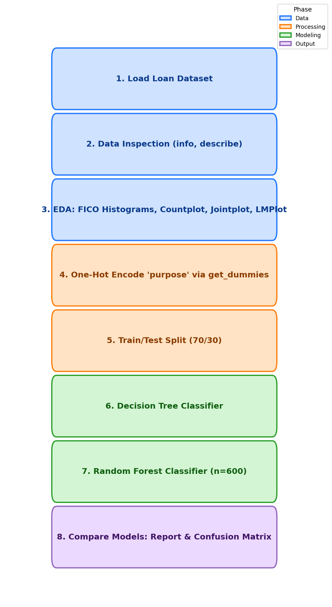

<div align="center">

# Lab 9: Decision Trees & Random Forests

**Predicting Loan Default with Tree-Based Classifiers**

[](#)
[](#)
[](#)
[](#)
[](#)
[](#)
[](#)
[](#)

</div>

---

## Overview

> Given publicly available LendingClub loan data from 2007-2010, **predict whether a borrower will fail to fully repay their loan** using a Decision Tree and a Random Forest, then compare the two models.

> **Note:** This lab follows the Decision Trees & Random Forests tutorial (`01-Decision Trees and Random Forests.ipynb`, based on the `kyphosis.csv` dataset) and applies the same methodology to the LendingClub loan data in the project notebook (`02-Decision Trees and Random Forest Project.ipynb`).

| | Detail |
|---|--------|
| **Lab Topic** | Decision Trees & Random Forests |
| **Tutorial Dataset** | `kyphosis.csv` |
| **Assignment Dataset** | `loan_data.csv` (LendingClub 2007-2010) |
| **Problem Type** | Binary Classification |
| **Target** | `not.fully.paid` (1 = borrower defaulted) |
| **Samples** | 9,578 loans |
| **Features** | 13 predictors (12 numeric + 1 categorical) |
| **Models** | DecisionTreeClassifier, RandomForestClassifier |
| **Class Imbalance** | ~84% paid, ~16% not fully paid |

---

## Dataset Features

| # | Feature | Description | Type |
|:-:|---------|-------------|:----:|
| 1 | `credit.policy` | 1 = meets LendingClub's credit underwriting criteria | Binary |
| 2 | `purpose` | Purpose of the loan (7 categories) | Categorical |
| 3 | `int.rate` | Interest rate (as a proportion) | Numeric |
| 4 | `installment` | Monthly installment owed | Numeric |
| 5 | `log.annual.inc` | Natural log of borrower's self-reported annual income | Numeric |
| 6 | `dti` | Debt-to-income ratio | Numeric |
| 7 | `fico` | FICO credit score | Numeric |
| 8 | `days.with.cr.line` | Days the borrower has had a credit line | Numeric |
| 9 | `revol.bal` | Revolving balance at end of billing cycle | Numeric |
| 10 | `revol.util` | Revolving line utilization rate | Numeric |
| 11 | `inq.last.6mths` | Inquiries by creditors in the last 6 months | Numeric |
| 12 | `delinq.2yrs` | Times the borrower was 30+ days past due in 2 years | Numeric |
| 13 | `pub.rec` | Derogatory public records | Numeric |
| 14 | `not.fully.paid` | Target (1 = borrower did not fully pay) | Binary |

---

## Key Concepts

| Concept | Description |
|---------|-------------|
| Decision Tree | Single tree that recursively splits the data on feature thresholds to maximize purity |
| Random Forest | Ensemble of many decision trees trained on bootstrap samples; predictions are averaged/voted |
| `pd.get_dummies` | Converts the categorical `purpose` column into one-hot encoded indicator columns |
| Class Imbalance | The target is skewed (~84/16), so overall accuracy alone is misleading — recall on the minority class matters |

---

## Methodology

<div align="center">



</div>

| Step | Phase | Description |
|:----:|-------|-------------|
| 1 | Data Loading | Load `loan_data.csv` using Pandas |
| 2 | Data Inspection | `info()`, `describe()`, `head()` |
| 3 | EDA | FICO histograms by `credit.policy` and `not.fully.paid`, countplot of `purpose`, jointplot of `fico` vs `int.rate`, `lmplot` split by repayment status |
| 4 | Encoding | `pd.get_dummies(cat_feats=['purpose'], drop_first=True)` |
| 5 | Train/Test Split | 70/30 split (`random_state=101`) |
| 6 | Decision Tree | Fit `DecisionTreeClassifier`, predict, evaluate |
| 7 | Random Forest | Fit `RandomForestClassifier(n_estimators=600)`, predict, evaluate |
| 8 | Comparison | Compare classification reports and confusion matrices to pick the best model per metric |

---

## Files

```
Lab9/
├── kyphosis.csv                                      # Tutorial dataset
├── loan_data.csv                                     # LendingClub project dataset (9,578 rows)
├── 01-Decision Trees and Random Forests.ipynb        # Doctor's tutorial notebook
├── 02-Decision Trees and Random Forest Project.ipynb # Project — DT & RF on LendingClub data
├── methodology_diagram.png                           # Workflow diagram
└── README.md                                         # This file
```
